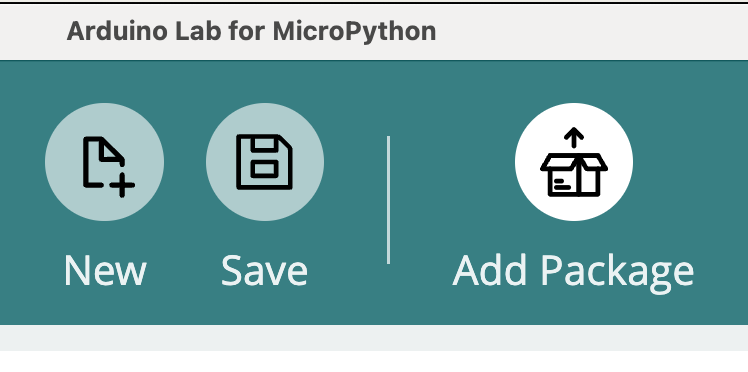

# Arduino Tools for MicroPython

This package adds functionalities for

* MicroPython Apps Framework
* File system helpers
* WiFi network management

## Installation

### Using Lab for MicroPython / MicroPython Package Installer

If you are using [Arduino Lab for MicroPython](https://labs.arduino.cc/en/labs/micropython) to work on your MicroPython projects, you can use the button "Install Package". This will launch [MicroPython Package Installer](https://labs.arduino.cc/en/labs/micropython-package-installer) or take you to the web page to download and install it.
Once installed, running it once will make sure that the Editor finds it at next time the button is pressed.



This tool simplifies installing packages from both the official MicroPython index and Arduino's curated package index on any MicroPython board.

### Using `mpremote`

We must specify the target especially if the framework is already installed and a default app is present, since `mpremote mip` will use the current path to look for or create the `lib` folder.
We want to make sure the tools are accessible from every application/location.

```bash
mpremote mip install --target=[flash]/lib github:arduino/arduino-tools-mpy
```

### Using `mip` from the board.

First make sure your board is connected to a network, or `mip` will fail.

```python
import mip
mip.install('github:arduino/arduino-tools-mpy', target='[flash]/lib')
```

## MicroPython Apps Framework

A set of tools and helpers to implement, create and manage MicroPython Apps.

A new approach to enabling a MicroPython board to host/store multiple projects with the choice of running one as default, as well as have a mechanism of fallback to a default launcher.
It does not interfere with the canonical `boot.py`  > `main.py` run paradigm, and allows users to easily activate this functionality on top of any stock MicroPython file-system.

The Arduino MicroPython App framework relies on the creation of aptly structured projects/apps enclosed in their own folders named "app_{app-name}", which in turn contain a set of files (`main.py`, `lib/`, `app.json`, etc.).
These are the conditions for a project/app to be considered "valid".
Other files can be added to user's discretion, for instance to store assets or log/save data.

The framework exploits the standard behaviour of MicroPython at start/reset/soft-reset:

1. run `boot.py`
1. run `main.py`

The framework's boot.py only requires two lines for the following operations:

* import the minimum required parts of arduino_tools (common) from the board's File System (installed as a package in [flash]/lib/arduino_tools)
* invoke the method `load_app(app_name = None, cycle_mode = False)` to enter the default app's path and apply some temporary settings to configure the running environment (search paths and launch configuration changes) which will be reset at the next start.

If no default app is set, it will fall back to the `main.py` in the board's root if present.
No error condition will be generated, as MicroPython is capable of handling the absence of `boot.py` and/or `main.py` at C level.

If a default app is set, the `load_app(app_name = None, cycle_mode = False)` will issue an `os.chdir()` command and enter the app's folder.
MicroPython will automatically run the main.py it finds in its Current Working Directory.

`cycle_mode`: when this parameter is `True`, the loader will pop first item from the `boot.cfg` file and append it to the end.
This could be useful if you have a board in demo mode (needing to display  multiple applications) or need to run applications in a sequence for RAM or features constraints.
You could think of a board that needs to connect to Internet to download data, but would not be able to process the data with the RAM available. 

**NOTES:**

* each app can contain a `.hidden` file that will hide the app from AMP, effectively preventing listing or deletion.
The `list_apps()` command accepts a `skip_hidden = False` parameter to return every app, not just the visible ones.

* each app should contain a metadata file named `app.json`

  ```json
    {
      "name": "",
      "friendly_name": "",
      "author": "", 
      "created": 0, 
      "modified": 0, 
      "version": "M.m.p", 
      "origin_url": "https://arduino.cc", 
      "tools_version": "M.m.p"
    }
  ```

* while some fields should be mandatory ("name", "tools_version") others could not be required, especially for students apps who do not care about versions or source URL.
We should also handle if extra fields are added not to break legacy.
Still WIP.

* AMP can replace/update an app with the contents of a properly structured `.tar` archive.
This is useful for updating versions of apps/launcher.
An app launcher could be delegated to checking for available updates to any of the other apps it manages.

### How to setup

**NOTE:** The API is not yet final, hence subject to changes.
Same goes for the name of modules.

The only requirement is that all the files in `arduino_tools` should be transferred to the board using one's preferred method.
Best practice is to copy all the files in the board's `[flash]/lib/arduino_tools`, which is what happens when installing with the `mip` tool (or `mpremote mip`).

Enter a REPL session

```python
from arduino_tools.app_manager import *
show_commands()
```

read through the commands to know more.

To enable the apps framework run
`enable_apps()`

The current `boot.py` (if present) will be backed up to `boot_backup.py`.
Any other file, including the `main.py` in the root (if present), will remain untouched.

`disable_apps()` will restore boot.py from boot_backup.py if it was previously created.
The method accepts a parameter `force_delete_boot` which defaults to `False`

If no backup file will be found it will ask the following:

This operation will delete "boot.py" from your board.
You can choose to:
A - Create a default one
B - Proceed to delete
C - Do nothing (default)

unless `disable_apps(True)` is invoked, which will force the choice to be B.

Setting the default app to '' (default_app('')) will also generate a choice menu.

The above behaviour is the result of Q&A sessions with other MicroPython developers and might be subject to change until a v1.0.0 is released.

### Basic usage

Note: creating an app and giving it a name with unallowed characters will replace them with an underscore (`_`).

Enable AMP and create a few apps

```shell
>>> from arduino_tools.apps_manager import *
>>> enable_apps()

>>> create_app('abc')
>>> create_app('def')
>>> create_app('ghi')
>>> create_app('new app') # space will be converted to _
>>> create_app('friendly_name', 'App friendly name') # This name will be sanitised and used as a human-readable one


>>> list_apps()
  abc
  def
  ghi
  new_app
  friendly_name


>>> default_app()
''

>>> default_app('def')
>>> default_app()
'def'

>>> list_apps()
  abc
* def
  ghi
  new_app
  friendly_name

>>> import machine
>>> machine.soft_reset

MPY: soft reboot
Hello, I am an app and my name is def
MicroPython v1.23.0-preview.138.gdef6ad474 on 2024-02-16; Arduino Nano ESP32 with ESP32S3
Type "help()" for more information.
>>> 
```

### Advanced Usage

#### Restore script (very experimental)

The restore script allows to have a way of restoring a default app at boot.
This script may respond to a hardware condition such as a pressed pin in order to set the default app to run.
This could be a menu or configuration script.
Can be used as a fault-recovery method.
See `generated_example/boot_restore.py`.
